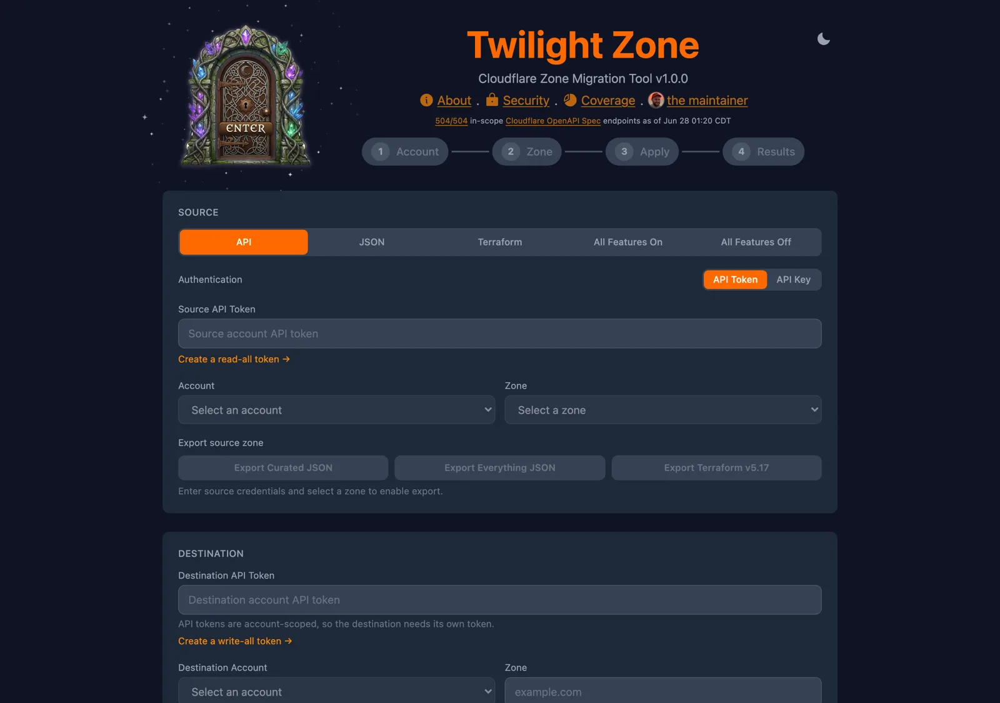

# Twilight Zone

A Cloudflare Worker that migrates a zone from one Cloudflare account to another.
It exports DNS, zone settings, rulesets, Workers, load balancers, Access
policies, and 30+ other resource types from a source zone and recreates them on
a destination account through an interactive, auditable wizard. Live version
available at https://twilight-zone.ross.gg



## Deploy your own

[](https://deploy.workers.cloudflare.com/?url=https://github.com/pocc/twilight-zone)

One click clones this repo into your GitHub/GitLab account, provisions the
`RUN_LOG` KV namespace, and deploys the Worker to your account. Or run it
locally:

```bash
npm install
npm run dev              # http://localhost:5173
npm run deploy           # vite build && wrangler deploy
```

Set your account ID before `dev`/`deploy` (wrangler reads it automatically), or
pin it in `wrangler.toml`:

```bash
export CLOUDFLARE_ACCOUNT_ID=your-account-id
```

## Features

- **Interactive wizard** — step-by-step, select-only review before any write
- **Complete zone export** — all configuration to JSON (also Terraform / OpenAPI)
- **Workers & Routes** — scripts, routes, and all 26 binding types
- **Storage data** — copies KV key/values and (with S3 credentials) R2 objects; creates D1 databases and Durable Object namespaces, with optional DO state migration
- **Load Balancers** — pools, monitors, and LB configs (with ID remapping)
- **Secrets & certificates** — prompts for worker secrets and custom SSL certs that can't be read from source
- **Migration report** — downloadable `migration_report.md` with per-resource status

## How it works

The wizard is a Setup landing (**step 0**) plus four numbered steps (1–4),
mirroring the engine's `migrateAccountResources` then `migrateZone` phases:

- **0 · Setup** — provide API tokens (or API key + email) and pick source/dest accounts + zone
- **1 · Account** — audit account-scoped resources (Workers, KV/R2/D1, Queues, LB, Access, Turnstile, …) and supply account-scoped secrets. Select-only — **Continue to Zone →**
- **2 · Zone** — audit zone-scoped resources (DNS, settings, rulesets, page rules, email routing, …) and supply zone-scoped secrets. Optional **Download script** and pre-cutover uptime monitor. Select-only — **Continue to Apply →**
- **3 · Apply** — the single "do it" step: review the plan, confirm the destination, then **Run migration →**. When it completes, work the interactive post-migration checklist (registrar nameserver change, DNSSEC, email verification, Turnstile sitekeys, KV/R2/D1 data copies)
- **4 · Results** — read-only verification of the merged report; download `migration_report.md`

The `migration_report.md` contains a summary (total / verified / acknowledged /
mismatched / failed), new nameservers to set at your registrar, per-section
detail, errors with suggestions, and a post-migration checklist.

(MaxConfig / MinConfig presets are not migrations — they apply a canned config
to a single zone, but still walk the Account and Zone review steps.)

## What gets migrated

Twilight Zone covers the Cloudflare API write surface across 65+ feature areas.
Rather than a hand-maintained list, two mechanisms keep coverage honest:

1. **Zone settings migrate dynamically** — whatever the source zone's settings
   API reports is migrated as-is, so a new setting needs no code change.
2. **An hourly Worker watches Cloudflare's OpenAPI spec** and raises an in-app
   banner + Google Chat ping the moment a new write endpoint appears, so drift
   is caught within the hour (live status: `GET /api/spec-status`; see
   [docs/SPEC_DRIFT_MONITOR.md](docs/SPEC_DRIFT_MONITOR.md)).

Some resources **cannot** move via API and are surfaced in Step 1/2 for explicit
acknowledgment before migration:

| Category | Examples |
|---|---|
| **Cryptographic** | Worker secrets, Access service-token secrets, Turnstile secrets, custom cert / Origin CA / Keyless SSL private keys |
| **Account-tied** | Registrar, BYOIP, Aegis IPs, Magic Transit/WAN/Firewall, China Network, FedRAMP, CNI |
| **Auto-managed** | Universal SSL, Managed Rulesets, DDoS managed rules, Smart Tiered Caching, Backup Certificates |
| **Read-only** | `cname_flattening`, `plan_level`, `orange_to_orange`, `advanced_ddos` |
| **Data-ephemeral** | Cache content, analytics history, audit logs, in-flight queue messages, KV TTLs |
| **Data-offline** | D1 rows (wrangler), R2 bulk objects (rclone), buffered Logpush, DO stored state |
| **Manual external** | DNSSEC DS at registrar, email-routing verification, nameserver change, custom hostname validation |

For the authoritative per-endpoint matrix (1,500+ write endpoints, feature
status, plan/entitlement requirements) see **[docs/COVERAGE.md](docs/COVERAGE.md)**.
"Out of scope" means *this tool doesn't migrate it* — most such features still
have their own migration paths via the dashboard, Terraform, or vendor tooling.

## Prefer to migrate manually?

Twilight Zone is one of several ways to migrate a zone. If you can't or don't
want to use it — for compliance reasons, a FedRAMP environment, no cross-account
API tokens, or you just want official tooling like `cf-terraforming` and
`wrangler` — follow the [Migration Guide](docs/MIGRATION_GUIDE.md) instead. It
walks the same end-to-end migration step-by-step and doubles as a "trust but
verify" checklist if you do use the tool.

## Limitations

1. **Nameserver change required** — the zone must be re-verified with new nameservers at your registrar.
2. **Worker secrets & private keys** — can't be read from source; you must provide them.
3. **Plan-dependent settings** — features may not transfer if source and destination plans differ (surfaced as acknowledged, not failed).
4. **Durable Object state** — the namespace is always created; stored **state** is copied only when you configure object names + source/dest worker URLs.
5. **KV & R2 data** — namespaces/buckets migrate automatically; KV values copy when you select the namespace, R2 **object data** only when you supply S3 credentials for both accounts.

## Data collection

*The website at https://twilight-zone.success.cloudflare.dev/ collects data to improve.
If you deploy this to your worker, you will get the logs instead.*

A **non-secret, non-PII** summary of each completed migration is logged
server-side (KV, 90-day retention): resource names, per-resource statuses, and
redacted error messages. **Credentials are never logged** — API tokens, keys,
worker secrets, and private keys exist only for the duration of each API call.
The landing-page "_N_ zones migrated" counter is derived from these logs. Full
allowlist, redaction, and retention details in
[docs/SECURITY.md](docs/SECURITY.md).

## Architecture

```
app/                 # React SPA (Vite) — wizard UI
src/
├── worker/index.ts  # Worker entry point + API routing
├── worker/api-v1.ts # Programmatic /api/v1/* JSON API
├── types.ts         # TypeScript interfaces + IMPOSSIBLE_TO_MIGRATE
├── api.ts           # Cloudflare API client functions
├── migrate.ts       # Migration orchestration entry (re-exports migrate/)
└── migrate/         # Export + migrate engine, split by concern
```

## ⚠️ Not a Cloudflare product; potential for LOSS OF DATA

> Twilight Zone is provided **"AS IS", WITHOUT WARRANTY OF ANY KIND**, per the
> [Apache License 2.0](LICENSE). It is an independent, best-effort tool.
> Bugs and requests go to this repository's issue tracker.
>
> You are solely responsible for verifying the
> result of any migration. Always confirm the destination zone before changing
> nameservers at your registrar. See also [NOTICE](NOTICE).

## Documentation

| Doc | What's in it |
|---|---|
| [ARCHITECTURE.md](docs/ARCHITECTURE.md) | System design, data flow, dependency resolution, ID remapping |
| [API.md](docs/API.md) | Full `/api/*` + `/api/v1/*` endpoint reference, request examples, token permissions |
| [SCRIPTS.md](docs/SCRIPTS.md) | Every npm alias and `scripts/*.mjs` tool |
| [MIGRATION_GUIDE.md](docs/MIGRATION_GUIDE.md) | End-to-end runbook, blockers, `IMPOSSIBLE_TO_MIGRATE` catalogue, manual flows |
| [VERIFICATION.md](docs/VERIFICATION.md) | Automated E2E settings verification + manual "trust but verify" checklist |
| [COVERAGE.md](docs/COVERAGE.md) | Tool coverage vs the CF API write surface (per-endpoint matrix) |
| [SECURITY.md](docs/SECURITY.md) | FedRAMP/NIST gap analysis, token permissions, run-logging details |
| [WORKER_BINDINGS.md](docs/WORKER_BINDINGS.md) | Every Workers binding type and how it's handled |
| [MAXCONFIG.md](docs/MAXCONFIG.md) | MaxConfig/MinConfig reference |
| [EXPORTS.md](docs/EXPORTS.md) | Export formats (JSON, Terraform, OpenAPI) |
| [SPEC_DRIFT_MONITOR.md](docs/SPEC_DRIFT_MONITOR.md) | Hourly spec-drift monitor + new-endpoint runbook |
| [TESTING.md](docs/TESTING.md) | Running the unit (vitest) + E2E (Playwright) suites |
| [ROADMAP.md](docs/ROADMAP.md) | Potential future features (e.g. "Sign in with Cloudflare" OAuth) |
| [CHANGELOG.md](docs/CHANGELOG.md) | Completed-work history |

## License

Apache-2.0
